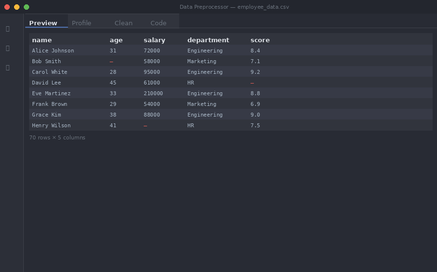
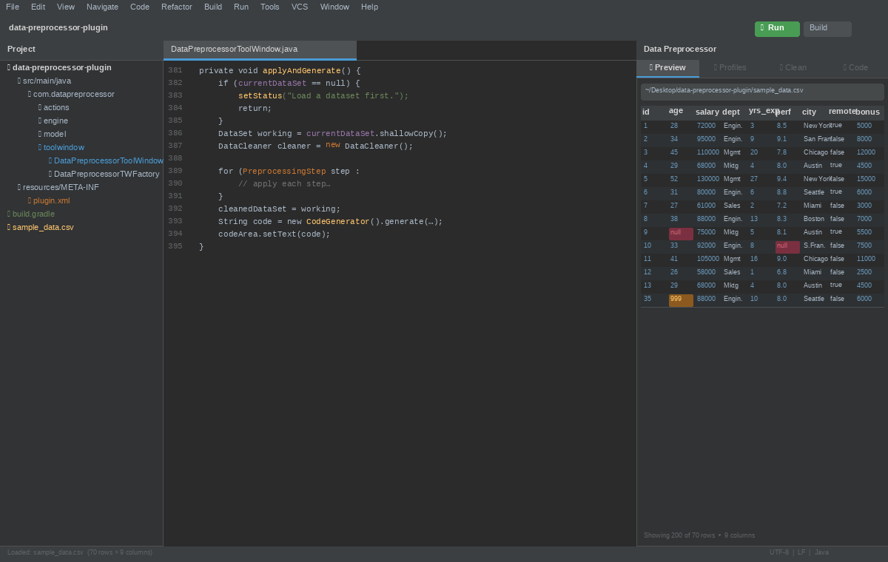
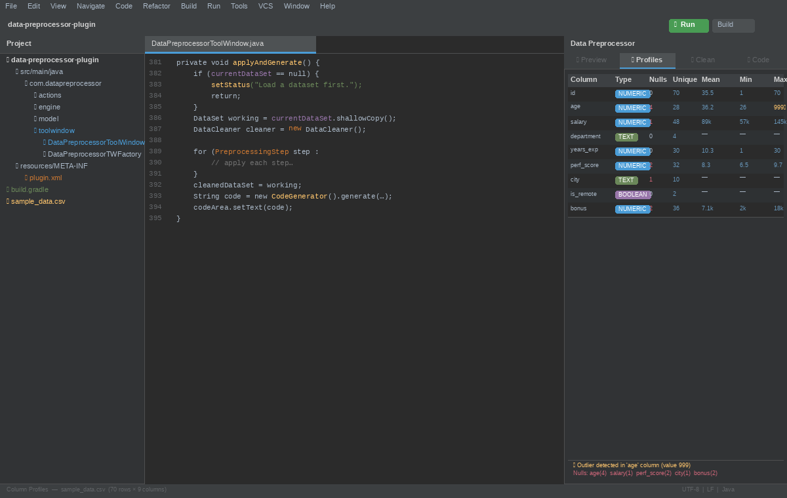
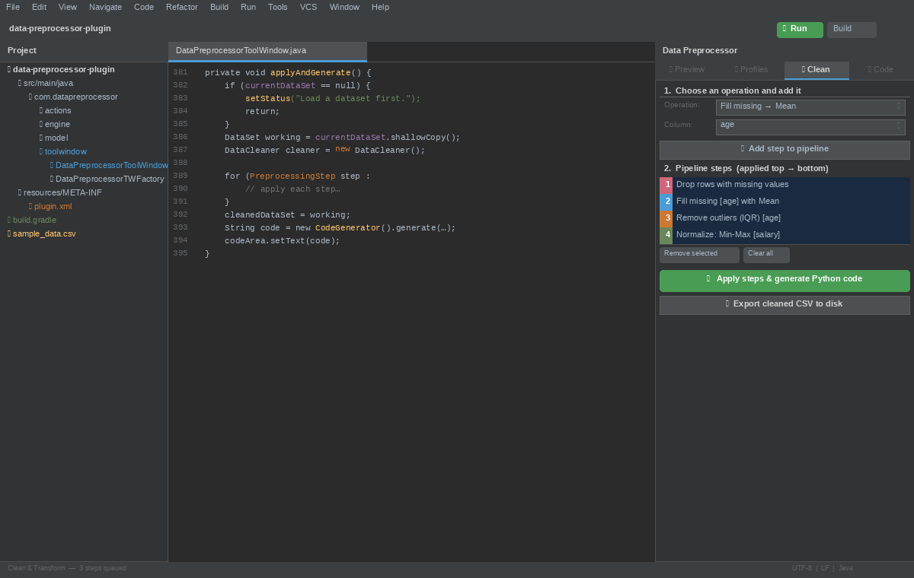
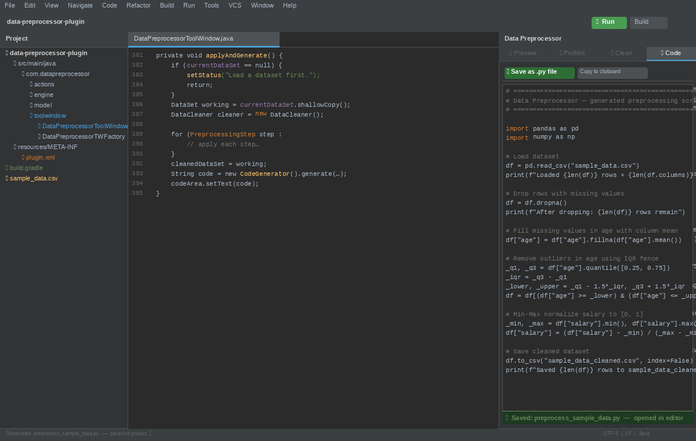

# Data Preprocessor — IntelliJ Plugin

[](https://plugins.jetbrains.com/plugin/31226-data-preprocessor)
[](https://plugins.jetbrains.com/plugin/31226-data-preprocessor)
[](https://plugins.jetbrains.com/plugin/31226-data-preprocessor)
[](LICENSE)

**An in-IDE data-cleaning and code-generation toolkit for data scientists — no Python environment needed.**

> 🔗 **[Install from JetBrains Marketplace →](https://plugins.jetbrains.com/plugin/31226-data-preprocessor)**

---



---

## What It Does

Data Preprocessor brings your data-cleaning workflow directly into IntelliJ IDEA. Load CSV, Excel, or JSON data, profile every column, apply transformations through a point-and-click UI, and generate ready-to-run **Python, R, or SQL** from the same pipeline — all without leaving the IDE.

| Tab | What you get |
|-----|-------------|
| **Preview** | Configurable table preview of your loaded dataset |
| **Profile** | Per-column stats: type, null count, unique values, mean, median, std, min, max, mode |
| **Clean** | Point-and-click operations that build a reproducible, editable pipeline |
| **Code** | Auto-generated Python, R, or SQL — save anywhere as `.py`, `.R`, or `.sql`, or copy to clipboard |
| **Visualise** | Histogram and box plot per numeric column; charts update after every Apply |

---

## Installation

### From the IDE (recommended)

1. Open **IntelliJ IDEA** (any edition, 2024.3+)
2. Go to **Settings → Plugins → Marketplace**
3. Search for **"Data Preprocessor"**
4. Click **Install** and restart the IDE

### From JetBrains Marketplace website

Visit [plugins.jetbrains.com/plugin/31226-data-preprocessor](https://plugins.jetbrains.com/plugin/31226-data-preprocessor) and click **Get**.

---

## Features

- **Load CSV, Excel, and JSON files** — browse and open data without leaving the IDE; also available via right-click on supported files in the Project view
- **Column Profiler** — type, null count, unique count, mean, median, std deviation, min, max, mode
- **Missing value handling** — drop rows, fill with mean / median / mode, or supply a custom value
- **Remove duplicates** — deduplicate rows in one click
- **Outlier removal** — IQR fence method (1.5 × IQR) to drop statistical outliers
- **Normalization** — Min-Max scaling [0, 1], Z-Score standardisation (mean=0, std=1), or Robust Scaler using median/IQR
- **Type casting** — cast any column to int, float, boolean, or string
- **Pipeline editing** — reorder, remove, clear, undo, and redo cleaning steps before applying them
- **Python code generation** — one click produces a complete, ready-to-run `pandas` script that mirrors every cleaning step you applied
- **R code generation** — one click produces an equivalent base-R script; `readxl`, `jsonlite`, and `fastDummies` imported only when needed
- **SQL code generation** — one click produces a PostgreSQL-style CTE template for database-side preprocessing
- **Column visualisations** — new Visualise tab renders a histogram or box plot for every numeric column; charts update automatically after Apply so you can see the effect of normalization or outlier removal instantly
- **Save as .py / .R / .sql** — choose where to save generated code; it opens directly in the IntelliJ editor
- **Export cleaned CSV** — choose where to save the cleaned dataset
- **Copy cleaned data as TSV** — copy the applied result for direct paste into Excel or Google Sheets
- **Settings page** — configure preview row limit, default normalization operation, and default train/test ratio under **Settings → Tools → Data Preprocessor**

---

## Screenshots

<table>
  <tr>
    <td></td>
    <td></td>
  </tr>
  <tr>
    <td align="center"><em>CSV Preview tab</em></td>
    <td align="center"><em>Column Profiler tab</em></td>
  </tr>
  <tr>
    <td></td>
    <td></td>
  </tr>
  <tr>
    <td align="center"><em>Clean operations panel</em></td>
    <td align="center"><em>Generated code tab</em></td>
  </tr>
</table>

---

## Usage

### Loading a file

- Open the **Data Preprocessor** tool window from the right-side panel, or
- Right-click any `.csv`, `.xlsx`, or `.json` file in the **Project** view → **Open in Data Preprocessor**

### Building a cleaning pipeline

1. Switch to the **Clean** tab
2. Select a column and operation from the dropdowns, then click **Add step**
3. Repeat for as many steps as needed
4. Reorder steps with **↑ Up** / **↓ Down**, or use **Undo** / **Redo** while editing
5. Click **▶ Apply steps** to preview the cleaned result
6. Click **🐍 Generate Python code**, **🔵 Generate R code**, or **🗄 Generate SQL code**

The **Code** tab populates with generated code for the selected language. Use **Save as script…** to choose a destination and open it in the editor, or copy and paste it into your notebook or database console.

### Exporting results

- **📤 Export cleaned CSV** — opens a save dialog and writes the applied result as CSV
- **Copy cleaned data as TSV** — copies headers and cleaned rows for spreadsheet paste
- **Save as script…** — opens a save dialog for `preprocess_<filename>.py`, `.R`, or `.sql` and opens it in the editor automatically

### Settings

Open **Settings → Tools → Data Preprocessor** to configure:

- **Preview row limit** — limits how many rows the Preview tab renders
- **Default normalization** — selects the default normalization operation in the Clean tab
- **Default train/test ratio** — pre-fills the Train / Test split ratio field

---

## Project Structure

```
src/main/java/com/datapreprocessor/
├── model/
│   ├── DataSet.java                             # In-memory tabular data model
│   └── ColumnProfile.java                       # Per-column statistics
├── engine/
│   ├── DataLoader.java                          # CSV → DataSet (Apache Commons CSV)
│   ├── DataCleaner.java                         # All cleaning & transformation logic
│   ├── CodeGenerator.java                       # Generates Python, R, and SQL code
│   ├── DataChartFactory.java                    # JFreeChart histogram and box plot factory
│   └── DataExporter.java                        # CSV and .py / .R / .sql file export
├── settings/
│   ├── DataPreprocessorSettings.java            # Persistent plugin settings
│   └── DataPreprocessorConfigurable.java        # Settings UI under Tools
├── actions/
│   ├── OpenDataFileAction.java                  # Right-click "Open in Data Preprocessor"
│   └── GeneratePreprocessingCodeAction.java     # Insert code at editor caret
└── toolwindow/
    ├── DataPreprocessorToolWindowFactory.java
    ├── DataPreprocessorToolWindow.java          # Coordinator — wires all panels (5 tabs)
    ├── HeaderBarPanel.java                      # Browse / path label / Reload
    ├── PreviewPanel.java                        # Tab 1 — raw data table
    ├── ProfilePanel.java                        # Tab 2 — per-column statistics
    ├── CleanPanel.java                          # Tab 3 — pipeline builder + actions
    ├── CodePanel.java                           # Tab 4 — generated code viewer
    └── VisualisationPanel.java                  # Tab 5 — histogram / box plot per column
```

---

## Building from Source

### Prerequisites

- JDK 17+
- Use the included Gradle wrapper — **do not use a system-installed Gradle**

### Run in a sandboxed IDE

```bash
./gradlew runIde
```

### Build distributable ZIP

```bash
./gradlew buildPlugin
# Output: build/distributions/data-preprocessor-plugin-*.zip
```

### Publish to JetBrains Marketplace

```bash
export PUBLISH_TOKEN=<your-marketplace-token>
./gradlew publishPlugin
```

> **Note:** Always run `./gradlew` (the wrapper), not `gradle`. The build requires Gradle 8.6 — the wrapper pins this automatically. Using a system Gradle 9.x will fail.

---

## Extending the Plugin

To add a new cleaning operation:

1. Add a variant to `CodeGenerator.Operation`
2. Implement the logic in `DataCleaner`
3. Add the generated-code translation in `CodeGenerator` for Python, R, and SQL where applicable
4. Add a label in the `opSelector` combo box in `CleanPanel`
5. Handle the new index in `CleanPanel.addStep()` and `CleanPanel.applySteps()`

---

## Privacy Policy

Data Preprocessor does not collect, store, or transmit any user data. All data processing is performed entirely locally within your IDE. No CSV content, file paths, column names, or usage metrics are ever sent anywhere.

Full privacy policy: [https://plugins.jetbrains.com/plugin/31226-data-preprocessor](https://plugins.jetbrains.com/plugin/31226-data-preprocessor)

---

## License

[MIT](LICENSE)

---

<p align="center">
  <a href="https://plugins.jetbrains.com/plugin/31226-data-preprocessor">
    
  </a>
</p>
